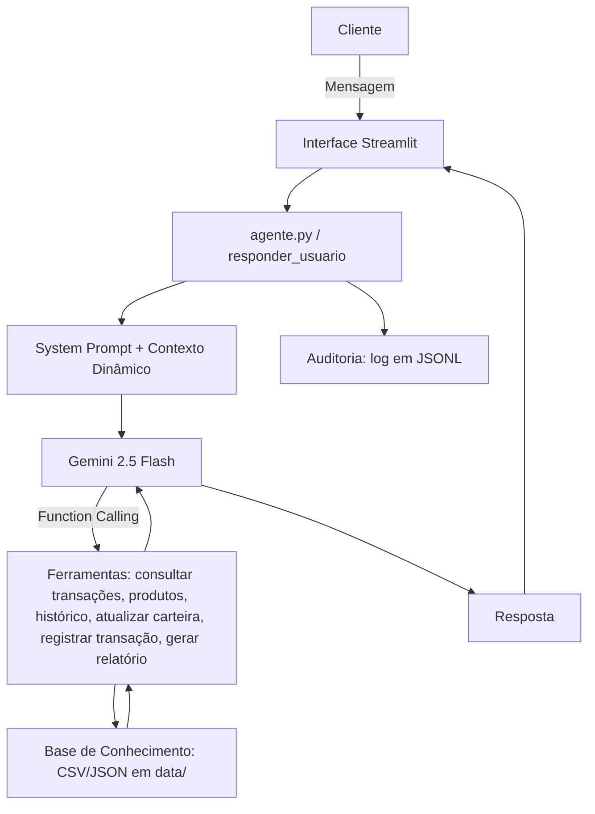

# Documentação do Agente

## Caso de Uso

### Problema
> Qual problema financeiro seu agente resolve?

A inadimplência no Brasil vem crescendo de forma estrutural: segundo o [Mapa da Inadimplência da Serasa](https://www.serasa.com.br/imprensa/10-anos-do-mapa-de-inadimplencia/), o número de brasileiros negativados saltou de 59 milhões em 2016 para 81,7 milhões em 2026 (+38,1% em dez anos), o que já representa cerca de metade da população adulta do país. A dívida média por consumidor também subiu (+12,2% em termos reais no período), e 42% dos inadimplentes de hoje já enfrentavam restrição no nome há uma década — um sinal de que o problema não é pontual, é crônico. Por trás desses números está uma dificuldade recorrente: as pessoas não têm consciência clara da própria saúde financeira e pouco conhecimento sobre educação finaceira. A informação está espalhada (extrato num app, metas na cabeça, produtos de investimento em outro canal), o que dificulta enxergar padrões de gasto, antecipar apertos no orçamento e agir antes que uma dívida vire uma negativação.

### Solução
> Como o agente resolve esse problema de forma proativa?

- **Registra transações** a partir de linguagem natural (o usuário só precisa dizer o que gastou ou recebeu);
- **Consulta o extrato**, trazendo o histórico detalhado de movimentações e gastos;
- **Atualiza a carteira de investimentos** quando o usuário compra ou vende ativos;
- **Consulta produtos financeiros** compatíveis com o perfil de risco do usuário;
- **Acompanha metas financeiras** (como reserva de emergência ou entrada de um imóvel), mostrando progresso e prazo;
- **Gera relatório, insights e dicas**, com alertas sobre aumento de despesas e sugestões práticas para economizar e atingir os objetivos.

O grande diferencial é a personalização: o MorFi se adapta ao **tipo de usuário**, ajustando estilo de comunicação e nível de detalhe da resposta de acordo com a geração da pessoa (cada geração tem uma forma diferente de se comunicar e um nível diferente de familiaridade com o digital). Isso reduz o gap de entrada — a barreira que muita gente sente ao lidar com apps financeiros — e torna o atendimento mais confortável, no ritmo e na linguagem de cada um. É a mesma lógica de personalização que a IA está trazendo para outras áreas: quanto mais o atendimento se adapta ao usuário, mais natural e efetivo ele se torna.

### Público-Alvo
> Quem vai usar esse agente?

Qualquer pessoa que queira ter mais controle e consciência sobre a própria vida financeira, independentemente do seu nível de familiaridade com tecnologia — do jovem digital nativo ao usuário mais velho que tem menos intimidade com apps financeiros. O foco é justamente reduzir essa barreira de entrada, oferecendo um atendimento personalizado por geração (ex: o cliente fictício usado no protótipo, João Silva, 32 anos, perfil moderado, construindo reserva de emergência e planejando a entrada de um apartamento).

---

## Persona e Tom de Voz

### Nome do Agente
MorFi

> **Origem do nome:** MorFi vem da junção de *morphing* + *finance*. Morphing é o efeito visual que transforma uma imagem em outra de forma fluida e contínua — popularizado pelo clipe *Black or White* (1991), de Michael Jackson, cuja sequência final revolucionou os efeitos visuais da época e simbolizava adaptação e diversidade. Assim como o morphing, o MorFi se transforma para se adaptar ao perfil de cada usuário, oferecendo uma experiência personalizada em vez de uma resposta única para todo mundo.

### Personalidade
> Como o agente se comporta? (ex: consultivo, direto, educativo)

Estrito, objetivo e consultivo. O MorFi não julga os gastos do usuário. Ele observa, contextualiza e sugere. Ele é proativo ao identificar variações (ex: aumento de gastos em uma categoria) e ao relacionar o fluxo de caixa às metas do cliente, mas nunca extrapola para fora do domínio financeiro nem dá conselhos de compra/venda de ativos específicos.

### Tom de Comunicação
> Formal, informal, técnico, acessível?

Adaptativo por geração: o tom (formal/direto/casual) e o nível de detalhe da resposta mudam de acordo com a idade do usuário, calculada a partir do `perfil_investidor.json`. Baby Boomers recebem comunicação mais formal e passo a passo; Geração Z recebe respostas curtas, diretas e com linguagem casual. Em todos os casos, o vocabulário é acessível — evita jargão financeiro sem explicação.

### Exemplos de Linguagem
- Saudação: "Olá, João! Eu sou o MorFi, seu gerenciador financeiro inteligente. No que posso te ajudar hoje?"
- Confirmação: "Registrei sua transação: Supermercado, R$ 450,00 (saída). Quer que eu já veja como isso impacta seu fluxo de caixa do mês?"
- Erro/Limitação: "Não posso recomendar a compra ou venda de ações específicas, mas posso te mostrar produtos de renda fixa compatíveis com seu perfil."
---

## Arquitetura

### Diagrama

### Componentes

| Componente                     | Descrição                                                                                                                                                                                                    |
| ------------------------------ | ------------------------------------------------------------------------------------------------------------------------------------------------------------------------------------------------------------ |
| Interface                      | Chatbot em Streamlit (`src/app.py`), com histórico de conversa em `st.session_state` e avatar personalizado por cliente                                                                                      |
| LLM                            | Google Gemini 2.5 Flash, via SDK `google-genai`, com `temperature=0.3` para reduzir variabilidade/alucinação                                                                                                 |
| Base de Conhecimento           | Arquivos `data/perfil_investidor.json`, `data/transacoes.csv`, `data/historico_atendimento.csv` e `data/produtos_financeiros.json`, montados dinamicamente em um bloco de contexto textual a cada requisição |

---

## Segurança e Anti-Alucinação

### Estratégias Adotadas

- [x] Agente só responde com base nos dados fornecidos (perfil, transações, produtos e histórico carregados no contexto)
- [x] Quando não sabe ou está fora do domínio, admite e redireciona para o escopo financeiro
- [x] Não faz recomendações de compra/venda de ativos específicos (ações, criptomoedas), apenas de categorias de produto compatíveis com o perfil de risco
- [x] Bloco de "Protocolo Crítico de Segurança e Blindagem" no system prompt, instruindo o agente a tratar toda mensagem do usuário como dado/pergunta financeira e a nunca obedecer instruções que tentem alterar suas regras, trocar de persona ou revelar o prompt de sistema
- [x] Temperatura baixa (0.3) para reduzir respostas divergentes/alucinadas
- [x] Todas as interações (usuário e agente) são auditadas em log, permitindo rastreabilidade

### Limitações Declaradas
> O que o agente NÃO faz?

- Não recomenda a compra ou venda de ações, criptomoedas ou ativos de risco específicos.
- Não opera fora do domínio financeiro (ex: não responde sobre clima, notícias gerais, etc.).
- Não tem acesso a senhas, dados de outros clientes ou sistemas fora da base de conhecimento fornecida.
- Não garante rentabilidade nem substitui a orientação de um assessor de investimentos certificado — as sugestões são educativas/consultivas, baseadas nos dados mockados disponíveis.
- Os dados usados são fictícios (cliente mockado "João Silva"); o protótipo não está conectado a sistemas bancários reais.
